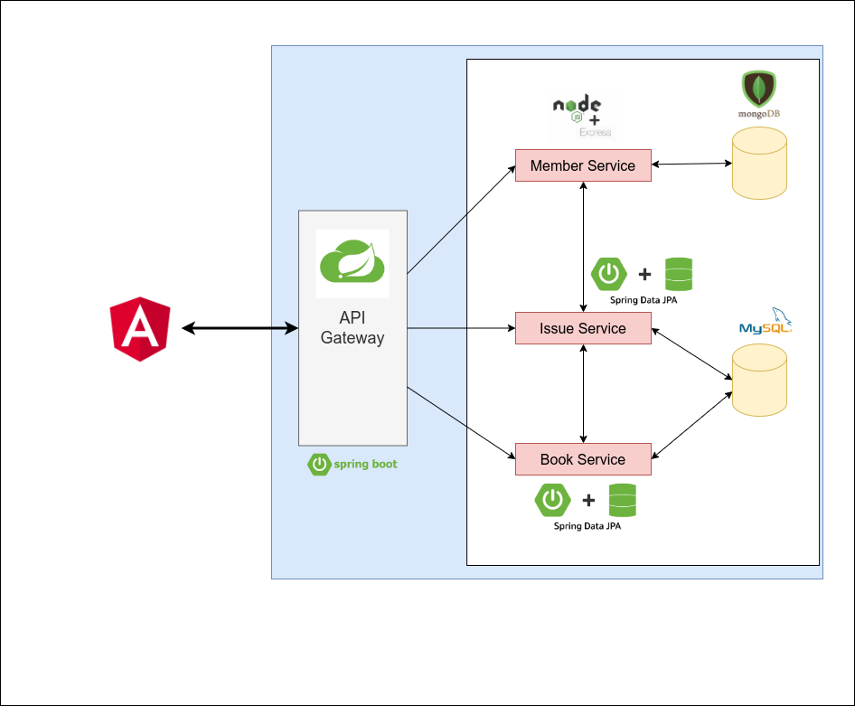

# LMS - Library Management System

A web application designed for monitoring and controlling a transaction in a Library. This system facilitate to manage members,
books and books issuing process. The project has been implemented using a Microservice architecture.

Technologies: Spring Boot, MongoBD, MySQl, Spring Data JPA, NodeJS, ExpressJS, Docker, Spring Security, Angular, Bootstrap.

## License

Copyright &copy; 2023. All Rights Reserved.

## Contact

For any inquiries or support, please contact [Kasun Chathuranga](mailto:kasunchathuranga3732@gmail.com).

## Screen Shots
### Overview

### Dashboard
[Dashboard.mp4](https://drive.google.com/file/d/1-pUyi91FORF6bfvL53Pcav0armiAYs1_/view?usp=sharing)

